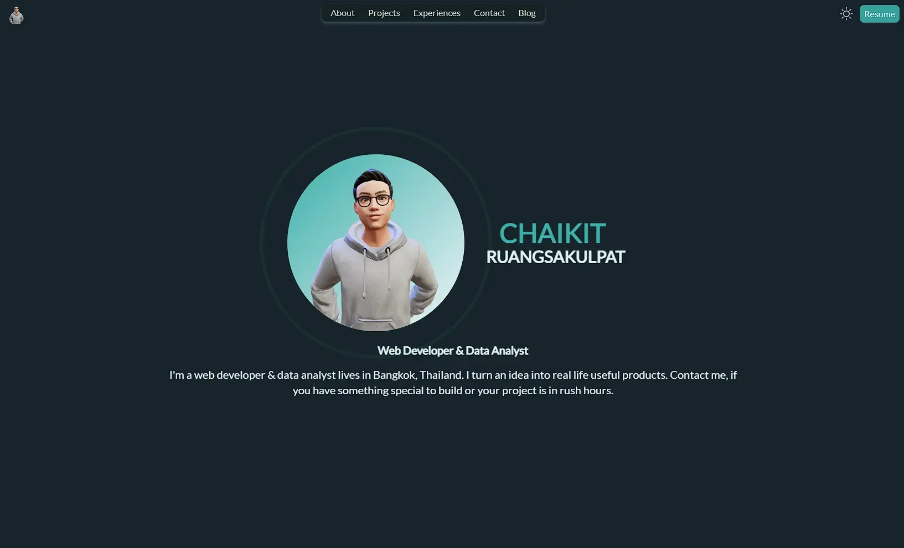

# [My Portfolio]()

This is a first project of my web developer journey. It taught me a lot when I have to do real work. This project shows who am I, what project I complete, what skill I have, where I work before, my contact, and link to my blog. I use Next, Tailwind, Framer, and Sanity to build the project.

## Features

- Page layout & customization
- Responsive website
- Component interaction & animation
- Dark mode
- Input data with headless CMS

## Tools

- Next.js (Typescript)
- Tailwind
- Framer-motion
- Sanity
